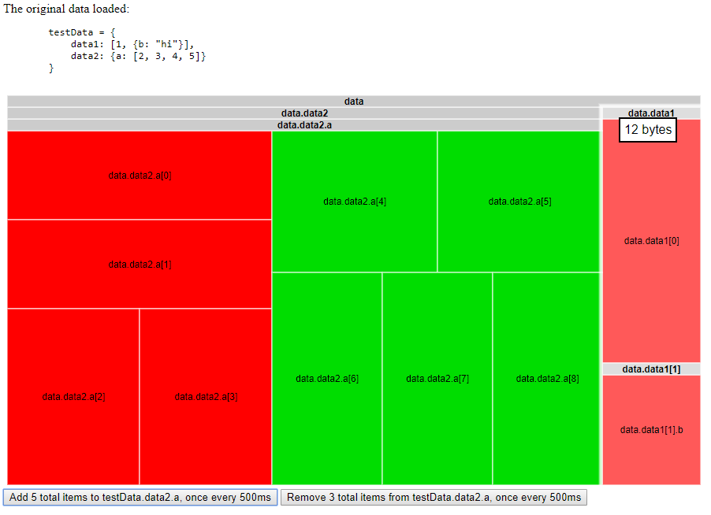

# JS Memory Map Visualizer

This library uses Google's TreeMap library to visualize the memory usage of a given object. Then, through nested Proxies, additions/deletions update the chart, making it easier to find memory leaks.

Each hierarcy level is displayed in the treemap, with the memory usage of each object displayed in a tooltip.



Colours can optionally be used to show where the memory usage is increasing, compared to the original amounts. This feature still needs some work, and needs to be toggled on via the `calculateDeltas` option. Unchanged values turn red when others increase, and green when others decrease, as the changes are relative.

Do note that things get a bit slow with really large objects. To help with performance, turn down the `depth` parameter. Turning `autoUpdate` to false also helps, as the rendering process can be resource intensive.

To use, create a `MemoryMap` object with your data. This will return an instance of the library. To  continue adding/reading from the data us the object stored in the `proxy` attribute, like so:
```javascript
const data = /* your data */

const memoryMap = new MemoryMap(data, configs)
const proxy = memoryMap.proxy

// ... use proxy from here on, eg:
proxy.stuff = "things" // this will update the chart if autoUpdate is set to true
```

You need to provide the google treemap library reference in the configs. If not provided, it will fall back to window.google, therefore assuming it is in the global context. The following script tag loads the library. See the included example, if this is unclear.
```html
<script src="https://www.gstatic.com/charts/loader.js"></script>
```


**Configurations**
|  Setting | What it does | Available Configurations | Default value |
|:-------------:| :-----:| :-----:| :---: |
| topKey | The key for the data item at the top level ("data", in the above image). Just an aesthetic change  | Any string | "data" |
| autoUpdate | Whether the chart will automatically be updated with new changes | true/false | true |
| depth | How many hierarchical levels to render data at  | any number | 5 |
| google | Reference to the google treemap library | The library  | window.google |
| container | The HTML container element for the chart | HTML element | document.body |
| chartConfig | An object to override the google chart configurations | See [the Google documentation](https://developers.google.com/chart/interactive/docs/gallery/treemap) | undefined |
| calculateDeltas | (Experimental) whether or not to calculate size deltas and display them using colour | true/false | false |

